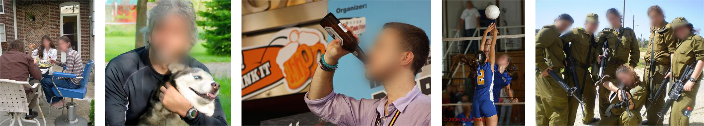
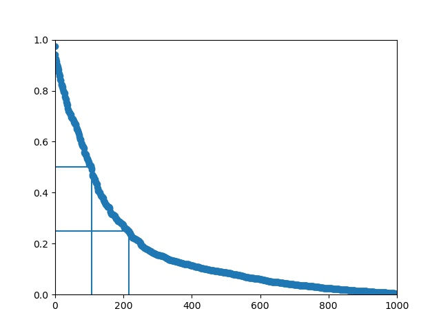
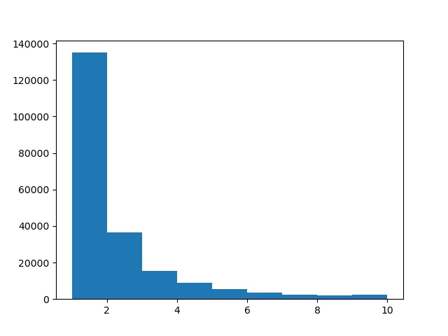

# A Study of Face Obfuscation in ImageNet




Code for the paper:  

[A Study of Face Obfuscation in ImageNet](https://arxiv.org/abs/2103.06191)  
[Kaiyu Yang](https://www.cs.princeton.edu/~kaiyuy/), [Jacqueline Yau](https://www.linkedin.com/in/jacqueline-yau-836b0a132/), [Li Fei-Fei](https://profiles.stanford.edu/fei-fei-li), [Jia Deng](https://www.cs.princeton.edu/~jiadeng/), and [Olga Russakovsky](https://www.cs.princeton.edu/~olgarus/)    


 ```bibtex
@inproceedings{yang2021imagenetfaces,
  title={A Study of Face Obfuscation in ImageNet},
  author={Yang, Kaiyu and Yau, Jacqueline and Fei-Fei, Li and Deng, Jia and Russakovsky, Olga},
  booktitle={International Conference on Machine Learning (ICML)}
  year={2022}
}
```


## Face Annotation

[crowdsourcing/ui.html](./crowdsourcing/ui.html) is the UI used for face annotation. It should be used as an HTML template in [simple-amt](https://github.com/jcjohnson/simple-amt). Please refer to the documentation of simple-amt for detail. The final face annotations are available for [download](https://drive.google.com/file/d/1XKx2U-9E_fkO4oIM92IB_MQrNCCKIl61/view?usp=sharing).


## Requirements

1. Download and install [Miniconda Python 3](https://docs.conda.io/en/latest/miniconda.html) (Anaconda should also work).  
1. Edit [imagenet-face-obfuscation.yaml](./imagenet-face-obfuscation.yaml) according to your system. For example, remove [- cudatoolkit=11.0](./imagenet-face-obfuscation.yaml#L09) if you don't have a GPU. Change the version of cudatoolkit if necessary. You could see the instructions for installing [PyTorch](https://pytorch.org/) for what CUDA version to put in [imagenet-face-obfuscation.yaml](./imagenet-face-obfuscation.yaml).   
1. Install Python dependencies using conda: `conda env create -f imagenet-face-obfuscation.yaml && conda activate imagenet-face-obfuscation`. If you have troubles with the aforementioned two steps, you may manually install the packages in [imagenet-face-obfuscation.yaml](./imagenet-face-obfuscation.yaml) in whatever way that works for you. 


## Data

Face detection results from Amazon Rekognition are available [here](https://drive.google.com/file/d/1wfzLFY14tA30DU8Ry66MA4eQpWKU6bL4/view?usp=sharing). The face-blurred images are avaialble for download on [the ImageNet website](http://image-net.org/download). They were generated by running `python experiments/blurring.py`. Please refer to the source file of [experiments/blurring.py](experiments/blurring.py) for details. For original images, please use the official [ILSVRC 2012 dataset](http://image-net.org/download).

Save the original images to `data/train/` and `data/val/`; save the blurred images to `data/train_blurred/` and `data/val_blurred/`. In each directory, each category should has a subdirectory, and images should be in the subdirectories. For example: `data/val_blurred/n02119022/ILSVRC2012_val_00012978.jpg`.


## Training and Validation

[experiments/trainval.py](./experiments/trainval.py) is the script for training and validation. It is based on an [example](https://github.com/pytorch/examples/tree/master/imagenet) from PyTorch with only minor changes. Most command-line options in the original example still apply. Please refer to the original [documentation](https://github.com/pytorch/examples/blob/master/imagenet/README.md) for details.  
For example, to train a ResNet18 on a single GPU.
```bash
python experiments/trainval.py -a resnet18 --learning-rate 0.1 --gpu 0
```
To train a ResNet50 on all GPUs on the current node:
```bash
python experiments/trainval.py -a resnet50 --learning-rate 0.1 --dist-url 'tcp://127.0.0.1:6666' --dist-backend 'nccl' --multiprocessing-distributed --world-size 1 --rank 0
```


We add a few additional command-line options for training/evaluating on face-obfuscated images:

* `--exp-id EXPID`: "EXPID" is an arbitrary experiment identifier. Model checkpoints will be saved to `EXPID_model_best.pth` and `EXPID_model_latest.pth`. Validation results will be saved to `EXPID_val_results.pickle`.   
* `--blur-train`: Use face-blurred images for training.  
* `--blur-val`: Use face-blurred images for validation.
* `--overlay`: Use overlayed images for both training and validation. It cannot co-occur with `--blur-train` or `--blur-val`.  

For example, to train and evaluate an AlexNet on face-blurred images:
```bash
python experiments/trainval.py -a alexnet --learning_rate 0.01 --gpu 0 --blur-train --blur-val --exp-id alexnet_blurred_train_blurred_val
```

To train a ResNet152 on face-blurred images but evalaute on original images:
```bash
python experiments/trainval.py -a resnet152 --learning-rate 0.1 --dist-url 'tcp://127.0.0.1:6667' --dist-backend 'nccl' --multiprocessing-distributed --world-size 1 --rank 0 --blur-train --exp-id hello_my_experiment
```

Models pretrained on face-blurred images are available for download [here](https://drive.google.com/drive/folders/1kr_IMocyg8hTSMWY_yzif4_tUVyHCiYU?usp=sharing).

Our validation results for all models are available [here](https://drive.google.com/drive/folders/1xbjmrjfyCO-56WCBay7IKpP_c6kgmR2p?usp=sharing). Before the next step, please download these pickle files to `eval_pickles/`. You could also run the training script to produce them by yourself.  


## Analyses

Please first make sure validation pickle files are in `eval_pickles/` and face annotations are in `data/face_annotations_ILSVRC.json`.   


#### Faces in different supercategories 
To produce Table 2 in the paper:
```bash
python analysis/supercategories.py
```
```
Supercategory              #Categories    #Images    With faces (%)
-----------------------  -------------  ---------  ----------------
clothing.n.01                       49      62471          58.9025
wheeled_vehicle.n.01                44      57055          35.2975
musical_instrument.n.01             26      33779          47.6361
bird.n.01                           59      76536           1.68809
insect.n.01                         27      35097           1.80642
```

#### Faces in different categories
To produce Figure 2 in the paper:
```bash
python analysis/num_images.py
```




#### Overall validation accuracy
To produce Table 3 in the paper:
```bash
python analysis/overall_accuracy.py
```
```
model               top1 original    top1 blurred       top1 diff  top5 original    top5 blurred       top5 diff
------------------  ---------------  ---------------  -----------  ---------------  ---------------  -----------
alexnet             56.043 +- 0.258  55.834 +- 0.108        0.209  78.835 +- 0.115  78.547 +- 0.071        0.288
squeezenet1_0       55.989 +- 0.179  55.323 +- 0.039        0.666  78.602 +- 0.172  78.061 +- 0.017        0.541
shufflenet_v2_x1_0  64.646 +- 0.178  64.001 +- 0.068        0.645  85.927 +- 0.024  85.458 +- 0.051        0.47
vgg11               68.905 +- 0.039  68.209 +- 0.128        0.695  88.682 +- 0.025  88.283 +- 0.046        0.399
vgg13               69.925 +- 0.058  69.271 +- 0.103        0.653  89.324 +- 0.064  88.928 +- 0.034        0.396
vgg16               71.657 +- 0.061  70.839 +- 0.047        0.818  90.456 +- 0.067  89.897 +- 0.108        0.559
vgg19               72.363 +- 0.023  71.538 +- 0.032        0.826  90.866 +- 0.053  90.289 +- 0.008        0.577
mobilenet_v2        65.378 +- 0.182  64.367 +- 0.203        1.011  86.651 +- 0.059  85.969 +- 0.060        0.682
densenet121         75.036 +- 0.055  74.244 +- 0.064        0.792  92.375 +- 0.031  91.958 +- 0.100        0.417
densenet201         76.984 +- 0.021  76.551 +- 0.044        0.433  93.480 +- 0.034  93.223 +- 0.068        0.257
resnet18            69.767 +- 0.171  69.012 +- 0.174        0.755  89.223 +- 0.024  88.738 +- 0.031        0.485
resnet34            73.083 +- 0.131  72.307 +- 0.351        0.776  91.289 +- 0.008  90.755 +- 0.130        0.534
resnet50            75.461 +- 0.198  75.003 +- 0.074        0.458  92.487 +- 0.015  92.360 +- 0.071        0.127
resnet101           77.254 +- 0.070  76.735 +- 0.092        0.519  93.591 +- 0.085  93.310 +- 0.052        0.281
resnet152           77.853 +- 0.117  77.279 +- 0.091        0.573  93.933 +- 0.038  93.674 +- 0.011        0.26
average             70.023           69.368                 0.655  89.048           88.630                 0.418
```

To produce Table B in the paper:
```bash
python analysis/overall_accuracy_overlay.py
```
```
model               top1 original    top1 overlayed      top1 diff  top5 original    top5 overlayed      top5 diff
------------------  ---------------  -----------------  -----------  ---------------  -----------------  -----------
alexnet             56.043 +- 0.258  55.474 +- 0.236          0.569  78.835 +- 0.115  78.172 +- 0.187          0.663
squeezenet1_0       55.989 +- 0.179  55.039 +- 0.221          0.95   78.602 +- 0.172  77.633 +- 0.108          0.969
shufflenet_v2_x1_0  64.646 +- 0.178  63.684 +- 0.033          0.962  85.927 +- 0.024  85.166 +- 0.167          0.761
vgg11               68.905 +- 0.039  67.834 +- 0.157          1.071  88.682 +- 0.025  87.880 +- 0.036          0.802
vgg13               69.925 +- 0.058  68.749 +- 0.015          1.175  89.324 +- 0.064  88.536 +- 0.062          0.788
vgg16               71.657 +- 0.061  70.568 +- 0.100          1.089  90.456 +- 0.067  89.573 +- 0.019          0.883
vgg19               72.363 +- 0.023  71.206 +- 0.152          1.158  90.866 +- 0.053  90.104 +- 0.050          0.762
mobilenet_v2        65.378 +- 0.182  64.335 +- 0.162          1.043  86.651 +- 0.059  85.728 +- 0.066          0.922
densenet121         75.036 +- 0.055  74.062 +- 0.048          0.974  92.375 +- 0.031  91.700 +- 0.025          0.675
densenet201         76.984 +- 0.021  76.056 +- 0.073          0.928  93.480 +- 0.034  92.868 +- 0.064          0.612
resnet18            69.767 +- 0.171  68.938 +- 0.069          0.829  89.223 +- 0.024  88.665 +- 0.110          0.557
resnet34            73.083 +- 0.131  72.369 +- 0.099          0.714  91.289 +- 0.008  90.699 +- 0.020          0.589
resnet50            75.461 +- 0.198  74.916 +- 0.007          0.545  92.487 +- 0.015  92.154 +- 0.027          0.333
resnet101           77.254 +- 0.070  76.677 +- 0.102          0.577  93.591 +- 0.085  93.114 +- 0.077          0.476
resnet152           77.853 +- 0.117  76.978 +- 0.149          0.875  93.933 +- 0.038  93.342 +- 0.246          0.592
average             70.023           69.126                   0.897  89.048           88.356                   0.692
```


#### Category-wise accuracies
To produce Table 4 in the paper:
```bash
python analysis/categorywise_accuracies.py
```
```
Category                 top1 original    top1 blurred       top1 diff  top5 original    top5 blurred       top5 diff  AP original      AP blurred         AP diff
-----------------------  ---------------  ---------------  -----------  ---------------  ---------------  -----------  ---------------  ---------------  ---------
eskimo_dog.n.01          50.800 +- 1.105  37.956 +- 0.412       12.844  95.467 +- 0.377  95.156 +- 0.166        0.311  19.378 +- 0.765  19.908 +- 0.481     -0.529
siberian_husky.n.01      46.267 +- 1.792  63.200 +- 0.762      -16.933  96.978 +- 0.440  97.244 +- 0.251       -0.267  29.198 +- 0.283  29.616 +- 0.485     -0.418
projectile.n.01          35.556 +- 0.880  21.733 +- 0.998       13.822  86.178 +- 0.412  85.467 +- 0.377        0.711  23.098 +- 0.365  22.537 +- 0.510      0.561
missile.n.01             31.556 +- 0.708  45.822 +- 0.817      -14.267  81.511 +- 0.725  81.822 +- 0.382       -0.311  20.404 +- 0.264  21.120 +- 0.633     -0.716
tub.n.02                 35.511 +- 1.462  27.867 +- 0.576        7.644  79.422 +- 0.600  75.644 +- 0.453        3.778  19.853 +- 0.430  18.778 +- 0.231      1.075
bathtub.n.01             35.422 +- 0.988  42.533 +- 0.377       -7.111  78.933 +- 0.327  80.800 +- 1.236       -1.867  27.378 +- 0.757  25.079 +- 0.584      2.299
american_chameleon.n.01  62.978 +- 0.350  54.711 +- 1.214        8.267  96.978 +- 0.491  96.578 +- 0.453        0.4    39.963 +- 0.184  39.292 +- 0.525      0.671
green_lizard.n.01        42.000 +- 0.566  45.556 +- 1.238       -3.556  91.289 +- 0.274  89.689 +- 0.166        1.6    22.615 +- 0.775  22.407 +- 0.095      0.208
```


## Face Blurring

 * [experiments/blurring.py](experiments/blurring.py): Our original implementation.
 * [minimalBlur](https://github.com/dfouhey/minimalBlur): Improved version by David Fouhey.


## Credits

* The code for training and evaluating models on ILSVRC is based on [an official PyTorch example](https://github.com/pytorch/examples/tree/master/imagenet). 
* The code is formatted using [](https://github.com/psf/black).

